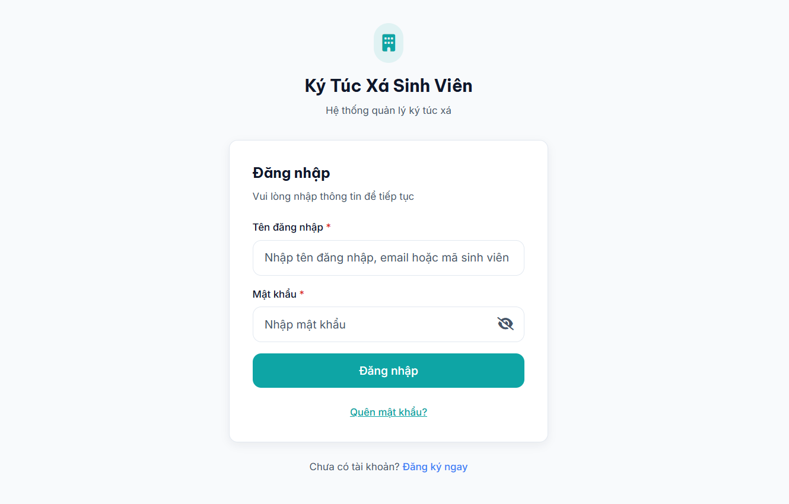
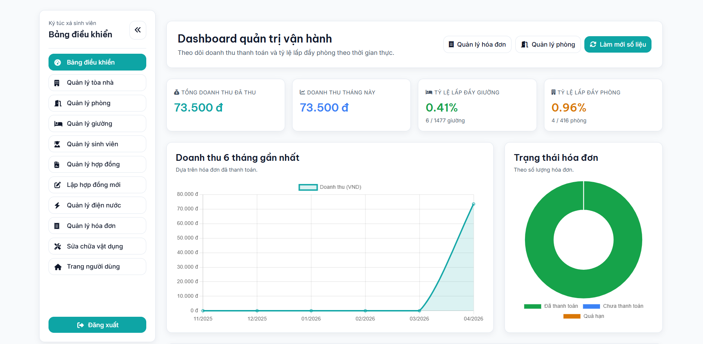
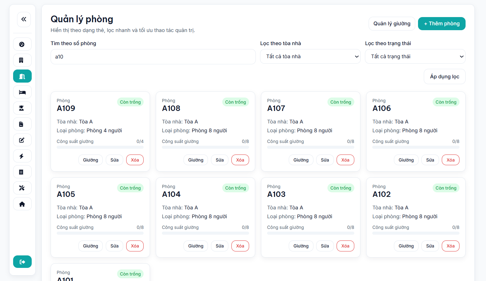
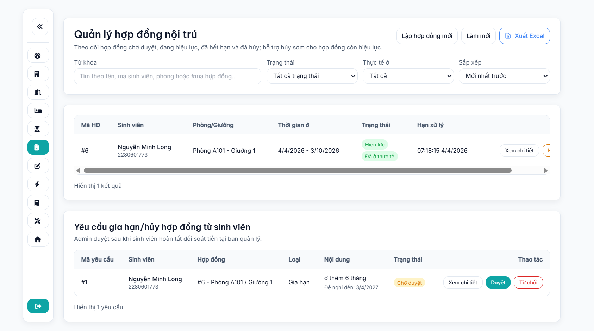
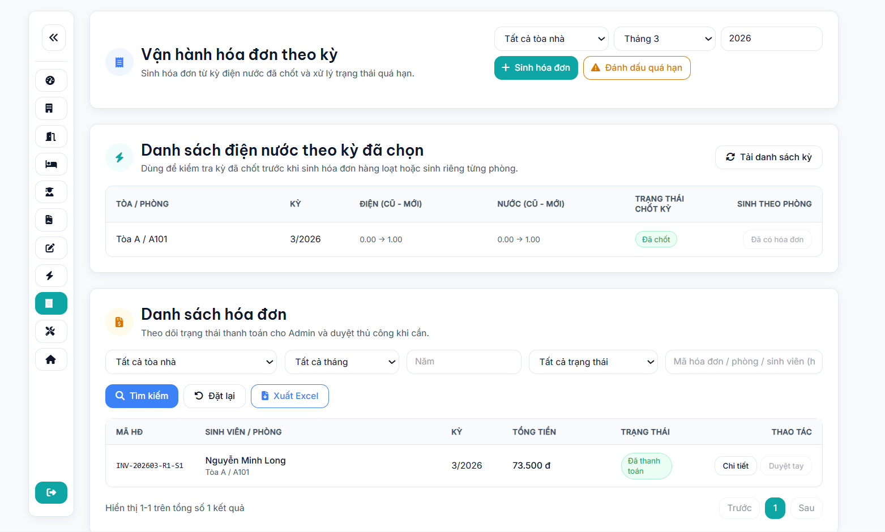
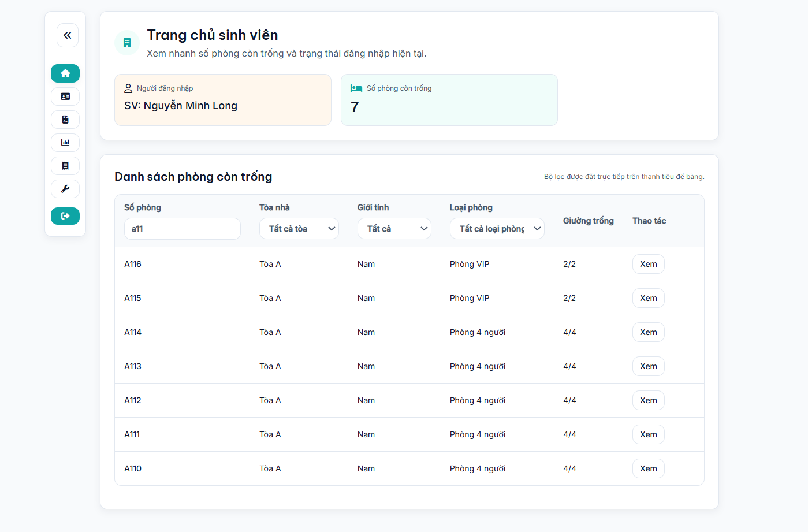
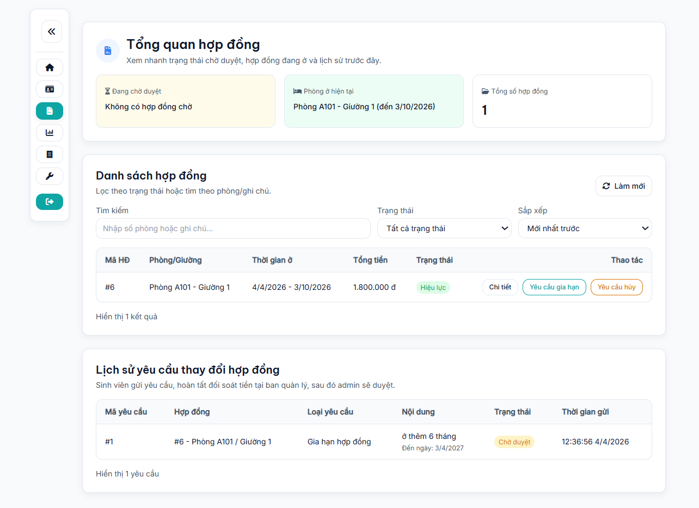
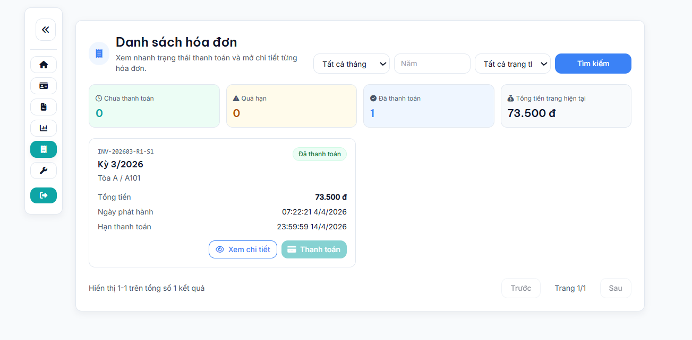

# Hệ Thống Quản Lý Ký Túc Xá Sinh Viên

Hệ thống quản lý ký túc xá sinh viên với backend Spring Boot và frontend static, hỗ trợ đầy đủ các quy trình: quản lý cơ sở vật chất, hợp đồng nội trú, điện nước, hóa đơn, thanh toán PayOS và vận hành quản trị.

## Mục lục

- [1) Tổng quan](#1-tổng-quan)
- [2) Tính năng cốt lõi](#2-tính-năng-cốt-lõi)
- [3) Công nghệ sử dụng](#3-công-nghệ-sử-dụng)
- [4) Kiến trúc hệ thống](#4-kiến-trúc-hệ-thống)
- [5) Hướng dẫn chạy nhanh](#5-hướng-dẫn-chạy-nhanh)
- [6) Cấu trúc thư mục](#6-cấu-trúc-thư-mục)
- [7) Ảnh màn hình chính](#7-ảnh-màn-hình-chính)
- [8) Tài liệu chi tiết](#8-tài-liệu-chi-tiết)
- [9) Endpoint chính](#9-endpoint-chính)
- [10) Kiểm thử và chất lượng](#10-kiểm-thử-và-chất-lượng)
- [11) Bảo mật và lưu ý triển khai](#11-bảo-mật-và-lưu-ý-triển-khai)

## 1) Tổng quan

Mục tiêu của dự án:

- Số hóa quy trình quản lý ký túc xá theo mô hình tập trung.
- Tăng tính minh bạch trong quản lý hợp đồng, điện nước, hóa đơn và thanh toán.
- Hỗ trợ cả góc nhìn quản trị và góc nhìn sinh viên trên cùng một hệ thống.

Vai trò người dùng chính:

- `ROLE_ADMIN`: quản trị tòa nhà, phòng, giường, sinh viên, hợp đồng, điện nước, hóa đơn, báo cáo.
- `ROLE_STUDENT`: quản lý hồ sơ cá nhân, hợp đồng của bản thân, hóa đơn, thanh toán, phản ánh sự cố.

## 2) Tính năng cốt lõi

### 2.1 Quản trị cơ sở vật chất

- Quản lý tòa nhà (`building`).
- Quản lý loại phòng (`room_type`), phòng (`room`) và giường (`bed`).
- Cập nhật bố cục giường và trạng thái sử dụng theo phòng.

### 2.2 Quản lý sinh viên

- Quản trị danh sách sinh viên và lịch sử nội trú.
- Sinh viên cập nhật hồ sơ cá nhân, đổi mật khẩu, cập nhật ảnh đại diện.

### 2.3 Quản lý hợp đồng nội trú

- Sinh viên giữ chỗ giường.
- Nộp hồ sơ hợp đồng và chờ duyệt.
- Quản trị duyệt/từ chối hợp đồng.
- Hỗ trợ yêu cầu thay đổi hợp đồng.
- Tự động xử lý hợp đồng quá hạn và giải phóng giường.

### 2.4 Điện nước và hóa đơn

- Nhập chỉ số điện nước theo phòng, theo kỳ tháng/năm.
- Chốt kỳ điện nước.
- Tự động sinh hóa đơn hàng tháng cho kỳ đã chốt.
- Theo dõi trạng thái hóa đơn: chưa thanh toán, quá hạn, đã thanh toán.

### 2.5 Thanh toán PayOS

- Sinh viên tạo liên kết thanh toán cho hóa đơn.
- Hệ thống nhận webhook PayOS và cập nhật trạng thái thanh toán.
- Hỗ trợ xác nhận thanh toán thủ công cho nghiệp vụ đặc thù.

### 2.6 Dashboard và báo cáo

- Dashboard quản trị tổng quan.
- Xuất Excel cho sinh viên, hợp đồng, hóa đơn, điện nước.

## 3) Công nghệ sử dụng

- Java 21
- Spring Boot 4.0.5
- Spring Web MVC, Spring Security, Spring Data JPA
- PostgreSQL
- JWT Bearer Authentication
- Caffeine Cache
- Apache POI (xuất Excel)
- PayOS API (tạo link thanh toán + webhook)

## 4) Kiến trúc hệ thống

Kiến trúc layered:

- `controller`: nhận request/response API.
- `service` và `service.impl`: xử lý nghiệp vụ.
- `repository`: truy vấn dữ liệu.
- `entity`: mô hình dữ liệu quan hệ.
- `dto`: chuẩn dữ liệu vào/ra.
- `security`: JWT, phân quyền, 401/403 handling.
- `config`: security, cache, email, seed data, mapper.

Luồng nghiệp vụ trọng yếu đã tài liệu hóa riêng:

- [docs/workflows/business-workflows-overview.md](docs/workflows/business-workflows-overview.md)
- [docs/workflows/contract-lifecycle-workflow.md](docs/workflows/contract-lifecycle-workflow.md)
- [docs/features-deep/monthly-invoice-automation.md](docs/features-deep/monthly-invoice-automation.md)
- [docs/features-deep/bed-status-expiry-automation.md](docs/features-deep/bed-status-expiry-automation.md)

## 5) Hướng dẫn chạy nhanh

### 5.1 Yêu cầu môi trường

- JDK 21
- PostgreSQL
- Maven Wrapper (`mvnw`, `mvnw.cmd`)

### 5.2 Chạy local

PowerShell:

```powershell
.\mvnw.cmd spring-boot:run
```

Hoặc chạy profile cụ thể:

```powershell
.\mvnw.cmd spring-boot:run "-Dspring-boot.run.profiles=dev"
```

### 5.3 Build và chạy artifact

```powershell
.\mvnw.cmd clean package
java -jar target/management-0.0.1-SNAPSHOT.jar --spring.profiles.active=prod
```

### 5.4 URL truy cập thường dùng

- Đăng nhập: `http://localhost:8080/login`
- Trang sinh viên: `http://localhost:8080/home`
- Trang quản trị: `http://localhost:8080/admin`

Chi tiết triển khai xem thêm: [docs/deployment/run-guide.md](docs/deployment/run-guide.md)

## 6) Cấu trúc thư mục

```text
src/
	main/
		java/com/dormitory/management/
			config/
			controller/
			dto/
			entity/
			exception/
			repository/
			security/
			service/
			service/impl/
		resources/
			application*.properties
			schema.sql
			static/
				admin/
				user/
				ui/
docs/
	architecture/
	deployment/
	features-deep/
	operations/
	standards/
	ui-ux/
	workflows/
```

## 7) Ảnh màn hình chính

### 7.1 Nhóm xác thực và trang chính




### 7.2 Nhóm quản trị lõi





### 7.3 Nhóm sinh viên





## 8) Tài liệu chi tiết

- Mục lục tài liệu tổng: [docs/README.md](docs/README.md)
- Kiến trúc: [docs/architecture/README.md](docs/architecture/README.md)
- Quy trình nghiệp vụ: [docs/workflows/README.md](docs/workflows/README.md)
- Phân tích sâu theo tính năng: [docs/features-deep/README.md](docs/features-deep/README.md)
- Chuẩn coding và API: [docs/standards/CODING_STANDARDS.md](docs/standards/CODING_STANDARDS.md), [docs/standards/API_CONTRACT.md](docs/standards/API_CONTRACT.md)

## 9) Endpoint chính

Base API: `/api/v1`

### 9.1 Xác thực

- `POST /auth/register/student`
- `POST /auth/login`
- `GET /auth/me`
- `POST /auth/forgot-password`
- `POST /auth/reset-password`

### 9.2 Cơ sở vật chất

- `GET /buildings`, `POST /buildings`, `PUT /buildings/{id}`, `DELETE /buildings/{id}`
- `GET /rooms`, `POST /rooms`, `PUT /rooms/{id}`, `DELETE /rooms/{id}`
- `GET /rooms/{roomId}/beds`
- `PUT /rooms/{roomId}/beds/{bedId}/occupancy`
- `PUT /rooms/{roomId}/beds/layout`
- `GET /room-types`

### 9.3 Sinh viên

- Admin:
	- `GET /students`, `GET /students/residents`, `GET /students/{id}`
	- `POST /students`, `PUT /students/{id}`, `DELETE /students/{id}`
- Student:
	- `GET /students/me`, `PUT /students/me`
	- `PUT /students/me/password`
	- `POST /students/me/avatar`

### 9.4 Hợp đồng

- Student:
	- `POST /contracts/reservations`
	- `PUT /contracts/{contractId}/submit`
	- `GET /contracts/me/pending`
	- `GET /contracts/me/contracts`
- Admin:
	- `POST /contracts`
	- `PUT /contracts/{contractId}/approve`
	- `PUT /contracts/{contractId}/reject`
	- `GET /contracts/admin/management`
	- `GET /contracts/admin/change-requests`

### 9.5 Điện nước và hóa đơn

- Utility records:
	- `POST /utility-records`, `POST /utility-records/batch`
	- `GET /utility-records/history`, `GET /utility-records/timeline`
	- `POST /utility-records/period/close`, `POST /utility-records/period/reopen`
- Invoices:
	- `POST /invoices/generate-monthly`
	- `GET /invoices/admin/list`
	- `GET /invoices/me`
	- `POST /invoices/me/{invoiceId}/create-payment-link`
	- `POST /invoices/{invoiceId}/manual-approve`

### 9.6 Thanh toán và báo cáo

- `POST /payment/webhook/payos`
- `GET /admin/dashboard/overview`
- `GET /reports/admin/students/excel`
- `GET /reports/admin/contracts/excel`
- `GET /reports/admin/invoices/excel`
- `GET /reports/admin/utility-records/excel`

Danh sách đầy đủ endpoint xem tại [docs/architecture/api-catalog.md](docs/architecture/api-catalog.md).

## 10) Kiểm thử và chất lượng

Chạy test:

```powershell
.\mvnw.cmd test
```

Khuyến nghị trước khi merge:

- Build thành công.
- Smoke test các API trọng yếu (auth, contracts, utility, invoices, payment webhook).
- Cập nhật tài liệu nếu thay đổi luồng nghiệp vụ hoặc API.

## 11) Bảo mật và lưu ý triển khai

- Không commit secret thật (DB, JWT, SMTP, PayOS).
- Cấu hình secret qua biến môi trường.
- Rotate khóa định kỳ trước khi đưa production.
- Ẩn thông tin nhạy cảm trên ảnh chụp màn hình trước khi commit.

---
